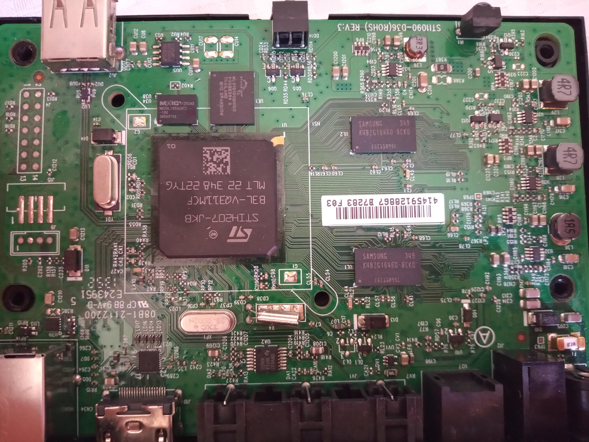

## Trying to hacking a STBh205-S1630-K8083

Hi!. I'm eolandro. I'm learning about reverse engineering.

I got some iptv S1630-K8083 devices from a dumpster. I'm a developer and
teacher, for changes in academic grid at the university, i need a update
in reverse engineering. 

So let's start.

### Table of contents

* (Looking for UART)[UART.md]
* Uboot Commands
* Getting the Nand
* in progress

