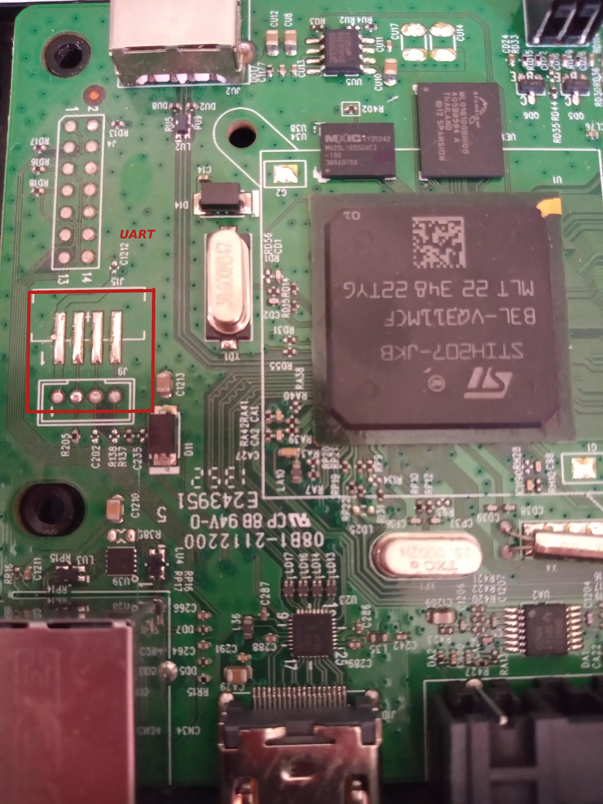

## UART

The uart is accesible. You can see in the photos folder.

The device is 3.3V.

Pinout

1. VCC 3.3
2. GND
3. TX
4. RX

Any USB2Serial adapter will work, just beware 3.3 Volt!.

The baudrate is 115200.
